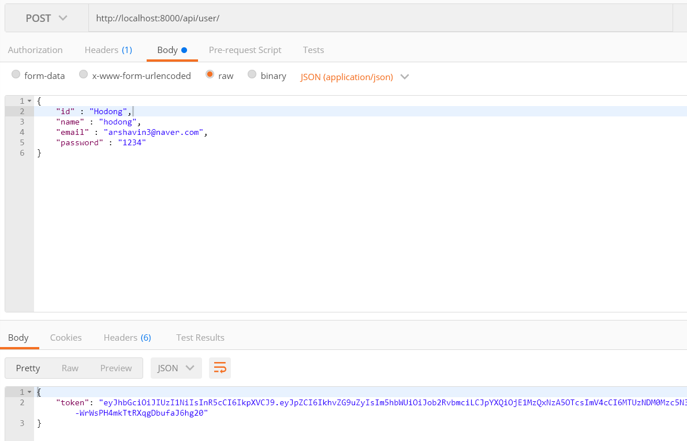

# signal-auth

## Getting Start (server)
**Server** is based on Node Typescript(Express | )
- node LTS
- typescript 2.8.1
- express 4.16.2
- sequelize 4.37.5
- mysql(mariadb)

## DB Setting
  dialect: 'mysql',
  database: 'test',
  username: 'root',
  password: '1234',
- config in lib/sequelize.ts

## Installation
```
npm install
yarn install
```


## Start server
```
npm start
yarn start
```
## Connection
